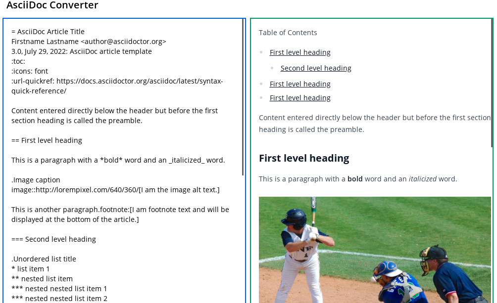

=  Asciidoc Clojurescript Online Editor

https://fnumatic.github.io/cljs-asciidoctor/

== Run application using babashka

https://github.com/babashka/babashka[babashka]

----
bb watch
bb compile
bb release
bb buildreport
----